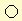



## OptiDraw

### Description

'OptiDraw' is actually a pretty descent drawing program. It's not as good as Microsoft's Paint, but I like to think it comes pretty close. You can load, save and print images, draw free-hand, draw lines, circles, rectacles, filled rectacles, and more. There are also some tools and filters. I integrated Sneechy's 'Instant Art' program and some other stuff from Planet Source Code, if I used your code, e-mail me at benny.rossaer@vt4.net and I will give you credit.
 
### More Info
 

             |
---                |---
**Submitted On**   |1999-12-13 18:42:10
**By**             |[Benny Rossaer](https://github.com/Planet-Source-Code/PSCIndex/blob/master/ByAuthor/benny-rossaer.md)
**Level**          |Intermediate
**User Rating**    |4.8 (29 globes from 6 users)
**Compatibility**  |VB 5\.0, VB 6\.0
**Category**       |[Complete Applications](https://github.com/Planet-Source-Code/PSCIndex/blob/master/ByCategory/complete-applications__1-27.md)
**World**          |[Visual Basic](https://github.com/Planet-Source-Code/PSCIndex/blob/master/ByWorld/visual-basic.md)
**Archive File**   |[CODE\_UPLOAD226712131999\.zip](https://github.com/Planet-Source-Code/benny-rossaer-optidraw__1-4888/archive/master.zip)

